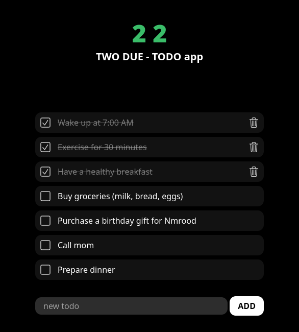

# 22 (TWODUE)
###### 2: TWO 🇬🇧, DUE 🇮🇹
###### 22: TWODUE = TODO
**22** is a simple and lightweight to-do application built using Rust and MoonZoon. It stores all data locally, eliminating the need for a database.
### Features
- **Simple and intuitive UI**: Easily manage your tasks with a clean and straightforward interface.
- **Local Storage**: Your to-do items are stored locally in your browser, so you can access them anytime without an internet connection.
- **Lightweight**: Designed to be fast and responsive, with minimal resource usage.

### Usage
- **Add a task**: Use the input field to type your task and press "Add" to add it to your to-do list.
- **Mark as complete**: Click on a task to mark it as complete.
- **Delete a task**: Click the delete button next to a task to remove it from your list.
### Contributing
Contributions are welcome! If you have ideas to improve the app or find bugs, feel free to open an issue or submit a pull request.
### License
This project is licensed under the MIT License
